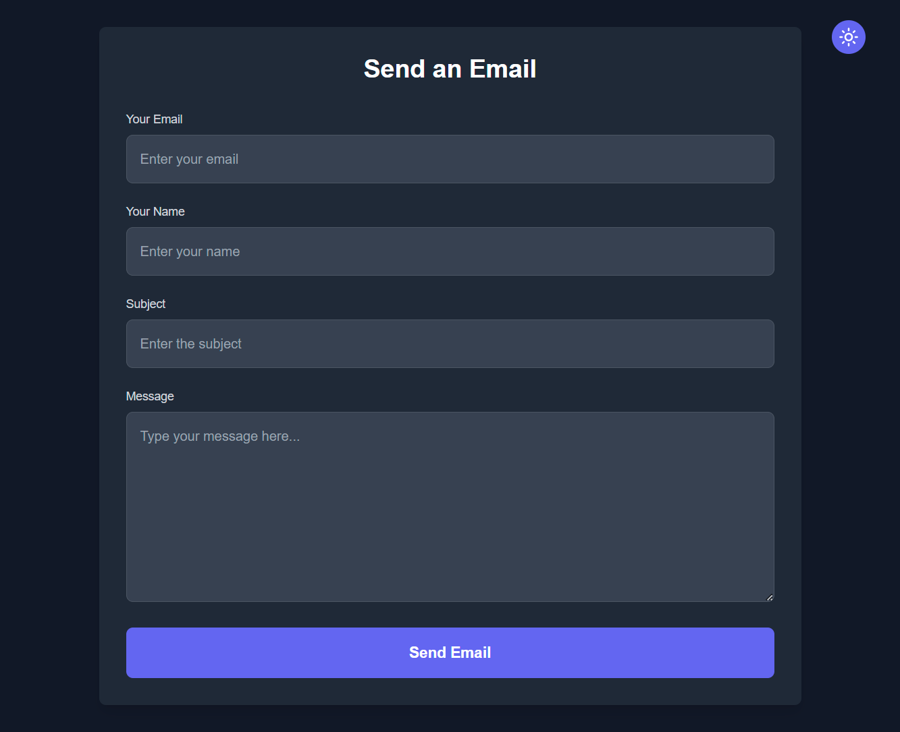
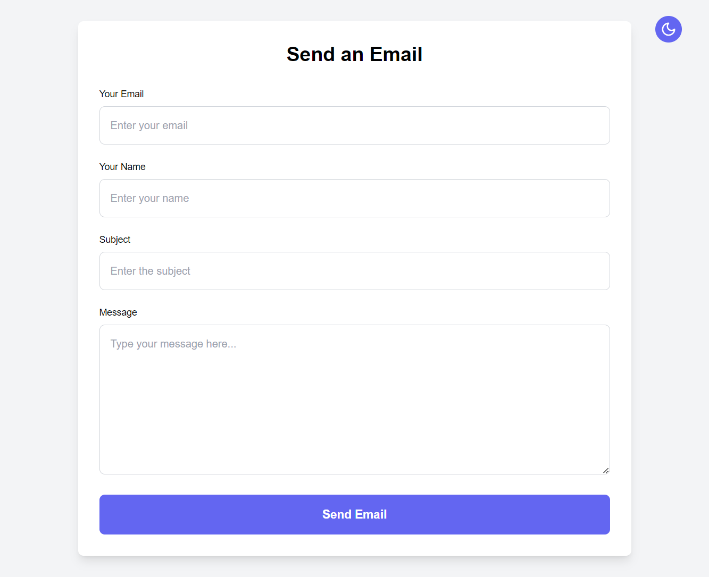

# Next Mailer App

# Email Sending Application

## Overview

This is a simple Next.js application that allows users to send emails via a form. Users can enter their email address, name, subject, and message body. The application also supports dark mode, enhancing user experience.

Dark mode             |  Light Mode
:-------------------------:|:-------------------------:
  |  

## Features

- **Email Form**: Users can fill out a form to send emails.
- **Dark Mode**: Toggle between light and dark themes for better accessibility.
- **Notifications**: Toast notifications for success and error messages.
- **Responsive Design**: The app is designed to work on different screen sizes.

## Technologies Used

- **Next.js**: React framework for server-side rendering and static site generation.
- **Tailwind CSS**: Utility-first CSS framework for styling.
- **Lucide React**: Icons for UI elements.
- **React Hot Toast**: For displaying toast notifications.
- **TypeScript**: Provides type safety to the application.

## Installation

To get started with this project, follow these steps:

### Prerequisites

Ensure you have the following installed on your machine:

- [Node.js](https://nodejs.org/en/) (version 12 or higher)
- [npm](https://www.npmjs.com/get-npm) (comes with Node.js)

### Clone the Repository

```bash
git clone https://github.com/yourusername/email-sending-app.git
cd email-sending-app

